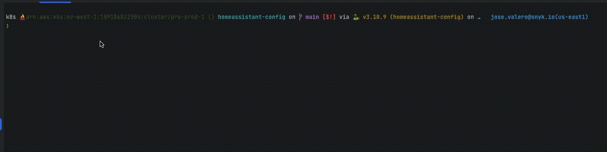
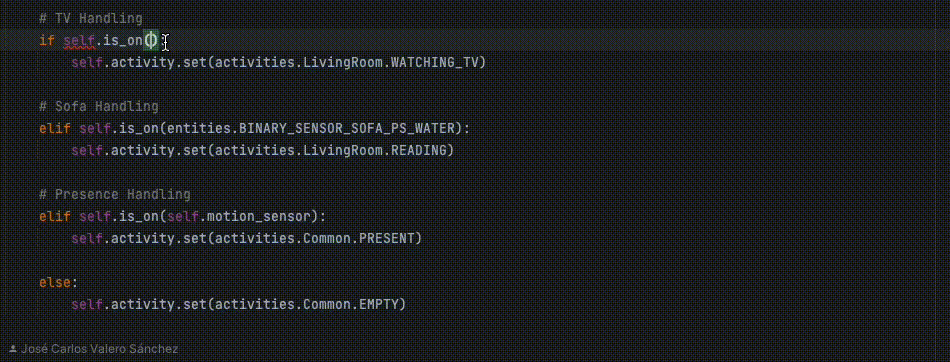
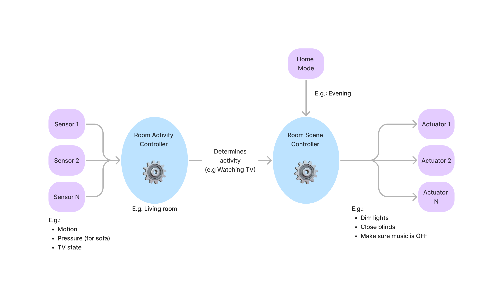

# homeassistant-config

This repository contains my home assistant's configuration, there are a few utils and ideas that you might find helpful for your house.

This repo is: 
- built on top of [appdaemons](https://appdaemon.readthedocs.io/en/latest/), 
- test-driven using [appdaemons test framework](https://floriankempenich.github.io/Appdaemon-Test-Framework/) (if I'm 
not being naughty), 
- and has a [code-generation](generate.py) helper to get python as typed as humanly possible (yes, I don't like python 🐍). 

## Features
Because I am using appdaemons apps in a very local manner, I prefer using in-code constants for my
entities, services... rather than yaml config.

For me this works best, as I get autocomplete and guarantees I am writing the right
things (I am dyslixec).

### Code generation

`python generate.py` will connect to your home assistant instance and will use the local config files
to generate types for services, entities, helpers among others.

The generated code uses types that are utilised in various helper functions throughout the automations to prevent
avoidable errors.

This will give you autocompletion in your appdaemons code.

It will also print unnecessary emojis.

### Activities, Mode, and Scenes

All the apps are built around the idea of activities, mode, and scenes, it looks a bit like this:

#### Activities
> Activities answer the question: *What are you doing in this room?*

Activities provide decoupling between sensors
and actuators, in a user-centric fashion. That is:
- **Watching TV** instead of _the TV is on_ and _the sofa pressure sensor is on_, 
- Or **Reading** instead of the sofa pressure sensor is on, but the TV is off, and your kindle is up and running.

In short, sensors are utilised to infer the activity that is being performed in a given room.

Activities are persisted using Select helpers in home assistant, enabling for manual mingling.

#### Mode
Mode models the current state of the house/day as a whole (e.g. day, night, away, or sleeping).

Mode is persisted using a Select helper in home assistant, enabling for manual mingling.

#### Scenes
> Scenes answer the question: *How should this room behave for this activity right now?*

Scenes control lighting, plugs, blinds, and any other actuators.

Scenes are applied taking into account:
- the activity of the room,
- as well as the mode.

This simple idea makes debugging and developing much easier, and the whole setup way more modular.

## Automations (aka Appdaemon Apps)
This is a non-comprehensive list of the apps this repo has

### Activity controllers
There's one activity controller per room. In its simpler form it 
determines if the room is occupied `PRESENT` or not `EMPTY`.

However, as I iterate I keep adding new activities based on various sensors,
for example the living room will detect if I am reading by checking
a pressure sensor on the sofa, or if I am watching TV by polling the TV.

### Scene controllers
Scene controllers will determine what things to turn on/off based on activities and mode.

In its simplest form it defines a scene to activate, but it can include arbitrary code to open
blinds, turn on/off plugs, change lighting...

### Mode manager / controller
The mode manager & controller take care of determining the mode to apply based on external factors
(e.g. home presence or time of the day), and actuating respectively.

Very much inline with how activities & scenes work but for the whole house.

### Vacuum cleaning
A simple app that makes sure the kitchen is clean if I have cooked trying to ensure
I am not around. (Otherwise I find myself being chased by robots).

### Vacuum maintenance
A simple app that truly shows who's wearing the pants in this house.
My vacuum cleaner comes moaning every now and then to demand maintenance love.
